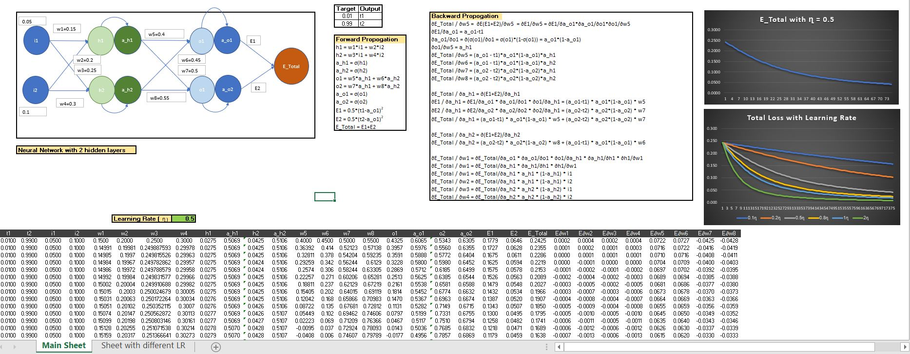
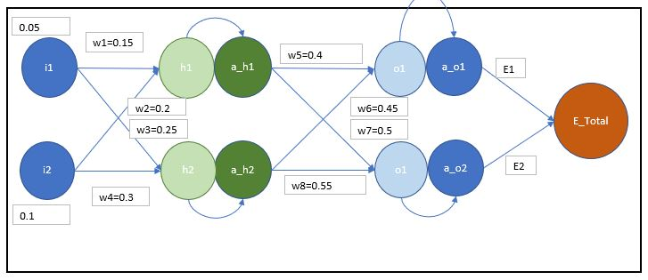
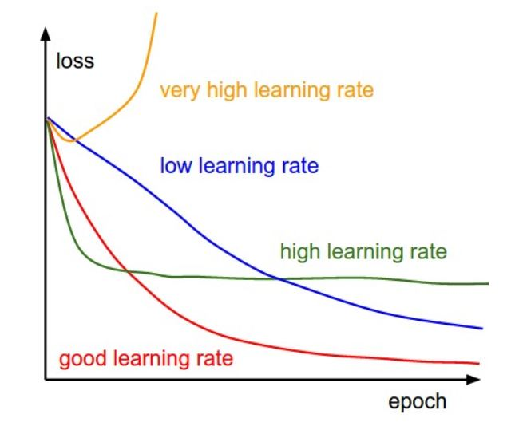
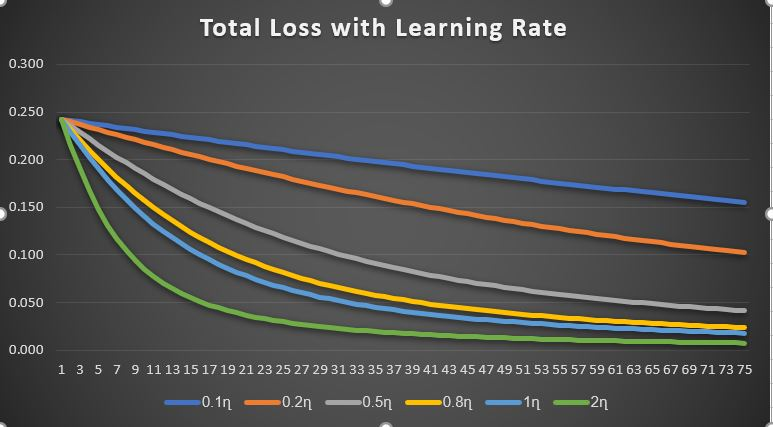

# Snapshot of Neural Net in Excel :

***********************************************************************************************************
# Explanation of Forward & Backward Propagation :

## For Forward Propagation:
- Inputs: i1, i2
- Activation function: Softmax.
- Actual Output = t1, t2

### 1st Layer:
1.	h1 = w1*i1 + w2*i2   
2.	a_h1 = σ(h1) = 1/(1+e-h1)  
3.	h2 = w3*i1 + w2*i2 
4.	a_h2 = σ(h2) = 1/(1+e-h2)  

### 2nd Layer:
1.	o1 = w5*a_h1 + w6*a_h2 
2.	a_o1 = σ(a_o1) = 1/(1+e-a_o1) 
3.	o2 = w7*a_h1 + w8*a_h2  
4.	a_o2 = σ(a_o2) = 1/(1+e-a_o2)

### Error:
1.	Error(E1) = 0.5*(t1-a_o1)2 
2.	Error(E2) = 0.5*(t1-a_o2)2 
3.	Total Error(E_total) = E1 + E2 

## Backward Propagation:
In backward propagation, we start from the output layer and propagate backwards, updating weights and biases for each layer. 
We adjust the weights and biases throughout the network, so that we get the desired output in the output layer. 
To update each node after every iteration, we need to calculate the error generated with respect to that node which is calculated with the help of the gradient. 
After each iteration of the epoch we observe that the total error is decreasing.

***********************************************************************************************************
##### To update w5 we need to calculate ∂E_Total/ ∂w5

Thus,  
∂E_Total/ ∂w5 = ∂(E1+E2) / ∂w5	As, E_total = E1 + E2  
= ∂E1 / ∂w5 + ∂E2 / ∂w5 = ∂E1/ ∂w5 (As w5 is not involved in the updation of E2 in forward propagation) 

By chain rule we can write,  

∂(E1+E2)/ ∂w5 = ∂E1/ ∂w5 = ∂E1/∂a_o1 * ∂a_o1/∂w5  
= ∂E1/∂a_o1 * ∂a_o1/∂o1 * ∂o1/∂w5 (As w5 is involved in updation of o1, which in turn affects the updation of a_o1, which produces the output E1)  
= ∂( 0.5*(t1-a_o1)2) / ∂a_o1 * ∂σ(o1)/∂o1 * ∂o1/∂w5  
= (a_o1 - t1) * a_o1*(1 - a_o1) * ∂ (w5*a_h1 + w6*a_h2)/ ∂w5  
= (a_o1 - t1) * a_o1*(1 - a_o1) * a_h1

Thus,  
∂E_Total/∂w5 = (a_o1 - t1) * a_o1*(1 - a_o1) * a_h1
-	w5 = w5 -  learning_rate *(∂E_Total/∂w5)
-	w5 = w5 -  ղ * (a_o1 - t1) * a_o1*(1 - a_o1) * a_h1
***********************************************************************************************************

##### To update w6 we need to calculate ∂E_Total/ ∂w6

Thus,  
∂E_Total/ ∂w6 = ∂(E1+E2) / ∂w6	As, E_total = E1 + E2  
= ∂E1 / ∂w6 + ∂E2 / ∂w6 = ∂E1/ ∂w6 (As w6 does not involve in updating of E2 in forward propagation) 
                    
By chain rule we can write,  

∂(E1+E2)/ ∂w6 = ∂E1/ ∂w6 = ∂E1/∂a_o1 * ∂a_o1/∂w6   
= ∂E1/∂a_o1 * ∂a_o1/∂o1 * ∂o1/∂w6 (As w6 is involved in updation of o1,which in turn affects the updation of a_o1, which produces the output E1)  
= ∂( 0.5*(t1-a_o1)2) / ∂a_o1 * ∂σ(o1)/∂o1 * ∂o1/∂w6   
= (a_o1 - t1) * a_o1*(1 - a_o1) * ∂ (w5*a_h1 + w6*a_h2)/ ∂w6  
= (a_o1 - t1) * a_o1*(1 - a_o1) * a_h2

Thus, 
∂E_Total/∂w6 = (a_o1 - t1) * a_o1*(1 - a_o1) * a_h2
-	w6 = w6 -  learning_rate *(∂E_Total/∂w6)
-	w6 = w6 -  ղ * (a_o1 - t1) * a_o1*(1 - a_o1) * a_h2

***********************************************************************************************************

##### To update w7 we need to calculate ∂E_Total/ ∂w7

Thus,  
∂E_Total/ ∂w7 = ∂(E1+E2) / ∂w7	As, E_total = E1 + E2
= ∂E1 / ∂w7 + ∂E2 / ∂w7 = ∂E2/ ∂w7 (As w7 does not involve in updating of E1 in forward propagation) 

By chain rule we can write,

∂(E1+E2)/ ∂w7 = ∂E2/ ∂w7 = ∂E2/∂a_o2 * ∂a_o2/∂w7   
= ∂E2/∂a_o2 * ∂a_o2/∂o2 * ∂o2/∂w7 (As w7 is involved in updation of o2, which in turn affects the updation of a_o2, which produces the output E2)
= ∂( 0.5*(t2-a_o2)2) / ∂a_o2 * ∂σ(o2)/∂o2 * ∂o2/∂w7  
= (a_o2 – t2) * a_o2*(1 - a_o2) * ∂ (w7*a_h1 + w8*a_h2)/ ∂w7  
= (a_o2 – t2) * a_o2*(1 - a_o2) * a_h1

Thus,  
∂E_Total/∂w7 = (a_o2 – t2) * a_o2*(1 - a_o2) * a_h1
- w7 = w7 -  learning_rate *(∂E_Total/∂w7)
- w7 = w7 -  ղ * (a_o2 – t2) * a_o2*(1 - a_o2) * a_h1

***********************************************************************************************************

##### To update w8 we need to calculate ∂E_Total/ ∂w8
Thus, 
∂E_Total/ ∂w8 = ∂(E1+E2) / ∂w8	As, E_total = E1 + E2
= ∂E1 / ∂w8 + ∂E2 / ∂w8 = ∂E2/ ∂w8 (As w8 does not involve in updating of E1 in forward propagation) 

By chain rule we can write,

∂(E1+E2)/ ∂w8 = ∂E2/ ∂w8 = ∂E2/∂a_o2 * ∂a_o2/∂w8
= ∂E2/∂a_o2 * ∂a_o2/∂o2 * ∂o2/∂w8 (As w8 is involved in updation of o2,which in turn affects the updation of a_o2, which produces the output E2)
= ∂( 0.5*(t2-a_o2)2) / ∂a_o2 * ∂σ(o2)/∂o2 * ∂o2/∂w8
= (a_o2 – t2) * a_o2*(1 - a_o2) * ∂ (w7*a_h1 + w8*a_h2)/ ∂w8
= (a_o2 – t2) * a_o2*(1 - a_o2) * a_h2

Thus,  
∂E_Total/∂w8 = (a_o2 – t2) * a_o2*(1 - a_o2) * a_h2
- w8 = w8 -  learning_rate *(∂E_Total/∂w7)
-	w8 = w8 -  ղ * (a_o2 – t2) * a_o2*(1 - a_o2) * a_h2

***********************************************************************************************************

##### To update w4 we need to calculate ∂E_Total/ ∂w4

By chain rule we can write,

∂(E_Total) / ∂w4 =  ∂E_Total/∂a_h2 * ∂a_h2/∂w4  
= ∂E_Total/∂a_o2 * ∂a_o2/∂o2 * ∂o2/∂a_h2 * ∂a_h2/∂h2 * ∂h2/∂w4 

(As w4 is involved in updation of h2, which is involved in the updation of a_h2,  
which is involved in updation of o1 and o2, which is involved in updation of  
a_o1 and a_o2 respectively, which in turn affects updation of E_Total)  

= (a_o2-t2) * a_o2*(1-a_o2) * w8 + (a_o1-t1) * a_o1*(1-a_o1) * w6 * a_h2 * (1-a_h2) * i2

Thus, 
∂E_Total / ∂w4 = (a_o2-t2) * a_o2*(1-a_o2) * w8 + (a_o1-t1) * a_o1*(1-a_o1) * w6 * a_h2 * (1-a_h2) * i2
- w4 = w4 – learning_rate * (∂E_Total/∂w4)
- w4 = w4 – ղ * (a_o2-t2) * a_o2*(1-a_o2) * w8 + (a_o1-t1) * a_o1*(1-a_o1) * w6 * a_h2 * (1-a_h2) * i2

***********************************************************************************************************

##### To update w3 we need to calculate ∂E_Total/ ∂w3

By chain rule we can write,

∂(E_Total) / ∂w3 =  ∂E_Total/∂a_h2 * ∂a_h2/∂w3  
=  ∂E_Total/∂a_o2 * ∂a_o2/∂o2 * ∂o2/∂a_h2 * ∂a_h2/∂h2 * ∂h2/∂w3  

(As w3 is involved in updation of h2, which is involved in the updation of a_h2,  
which is involved in updation of o1 and o2, which is involved in updation of   
a _o1 and a_o2 respectively, which in turn affects updation of E_Total)  

= (a_o2-t2) * a_o2*(1-a_o2) * w8 + (a_o1-t1) * a_o1*(1-a_o1) * w6  * a_h2 * (1-a_h2) * i1
		
Thus,  
∂E_Total / ∂w3= (a_o2-t2) * a_o2*(1-a_o2) * w8 + (a_o1-t1) * a_o1*(1-a_o1) * w6 * a_h2 * (1-a_h2) * i1  
- w3 = w3 – learning_rate * (∂E_Total/∂w3)  
- w3 = w3– ղ * (a_o2-t2) * a_o2*(1-a_o2) * w8 + (a_o1-t1) * a_o1*(1-a_o1) * w6 * a_h2 * (1-a_h2) * i1

***********************************************************************************************************

##### To update w2 we need to calculate ∂E_Total/ ∂w2

By chain rule we can write,

∂(E_Total) / ∂w2 =  ∂E_Total/∂a_h1 * ∂a_h1/∂w2  
=  ∂E_Total/∂a_o1 * ∂a_o1/∂o1* ∂o1/∂a_h1 * ∂a_h1/∂h1 * ∂h1/∂w1  

(As	w2 is involved in updation of h1, which is involved in the updation of a_h1,  
which is involved in updation of o1 and o2 respectively , which is involved in updation of   
a_o1 and a_o2, which in turn affects updation of E_Total)  

= (a_o1-t1) * a_o1*(1-a_o1) * w5 + (a_o2-t2) * a_o2*(1-a_o2) * w7 * a_h1 * (1-a_h1) * i2

Thus,  
∂E_Total / ∂w2= (a_o1-t1) * a_o1*(1-a_o1) * w5 + (a_o2-t2) * a_o2*(1-a_o2) * w7 * a_h1 * (1-a_h1) * i2  
- w2 = w2 – learning_rate * (∂E_Total/∂w2)  
- w2= w2– ղ * (a_o1-t1) * a_o1*(1-a_o1) * w5 + (a_o2-t2) * a_o2*(1-a_o2) * w7 * a_h1* (1-a_h1) * i2

***********************************************************************************************************

##### To update w1 we need to calculate ∂E_Total/ ∂w1

By chain rule we can write,

∂(E_Total) / ∂w1 =  ∂E_Total/∂a_h1 * ∂a_h1/∂w1  
=  ∂E_Total/∂a_o1 * ∂a_o1/∂o1* ∂o1/∂a_h1 * ∂a_h1/∂h1 * ∂h1/∂w1  

(As	w1 is involved in updation of h1, which is involved in the updation of a_h1,  
which is involved in updation of o1 and o2, which is involved in updation of   
a_o1 and a_02 respectively, which in turn affects updation of E_Total)

= (a_o1-t1) * a_o1*(1-a_o1) * w5 + (a_o2-t2) * a_o2*(1-a_o2) * w7 * a_h1 * (1-a_h1) * i1  

Thus, 
∂E_Total / ∂w1= (a_o1-t1) * a_o1*(1-a_o1) * w5 + (a_o2-t2) * a_o2*(1-a_o2) * w7 * a_h1 * (1-a_h1) * i1  
- w1 = w1 – learning_rate * (∂E_Total/∂w1)  
- w1= w1– ղ * (a_o1-t1) * a_o1*(1-a_o1) * w5 + (a_o2-t2) * a_o2*(1-a_o2) * w7 * a_h1* (1-a_h1) * i1

***********************************************************************************************************

# Total Loss with different Learning Rate :

The smaller learning rate will result in very small updation in the weights and our model will take a lot of time to train and learn the optimal weights, and, a higher learning rate results in rapid changes and often results in a sub-optimal final set of weights. A desirable learning rate is low enough that the network converges to something useful, but high enough that it can be trained in reasonable time. Generally the learning rate is between 0 and 1.

## Plot of loss with LR = [0.1,0.2,0.5,0.8,1.0,2.0]

### In our case as the #epochs were very less and data was quite simple to see the above patter which happens in actual scenario
